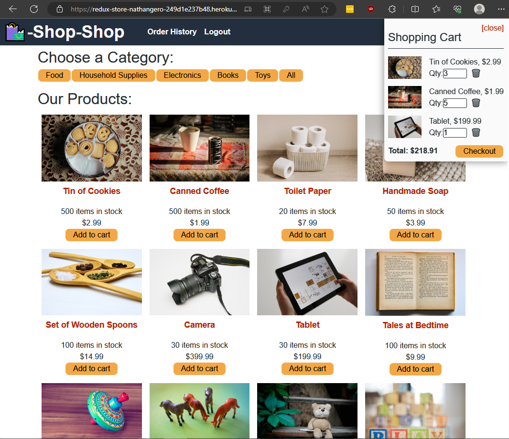

# Redux Store

## Desscription
The purpose of this repo was to convert code from using React Context API to React Redux Store. The code under the `backup/pre-redux` branch was provided to me, so I only refactored it. What I did was refactor the `StoreProvider` function inside the `GlobalState.jsx` file. In order to refactor this code, I put the state variables inside the `reducer` function in the `reducers.js` file. Under [code snippets](#code-snippets) section I'll put an example of what I did to some of the components.

You can visit the deployed link here: [https://redux-store-nathangero-249d1e237b48.herokuapp.com/](https://redux-store-nathangero-249d1e237b48.herokuapp.com/)

## Image

Screenshot of website working off of Redux Store



## Code Snippets

Example of code I refactored in some of the components

```js
// import { StoreProvider } from '../../utils/GlobalState'
import { useDispatch, useSelector } from 'react-redux';
```

```js
// const [state, dispatch] = useStoreContext();
const dispatch = useDispatch();
const state = useSelector((state) => state);
```

## Credits

[ReduxJS docs](https://redux.js.org/)